# Marcus Elliott - Blue Badge Workout Log - Server.

# /user/register - Allows a new user to be created with a username and password.

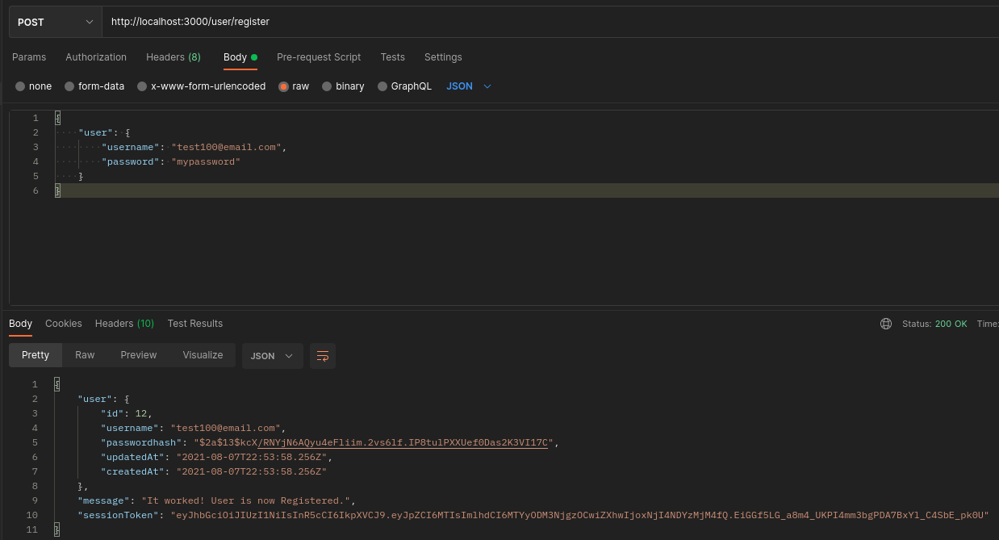

# /user/login - Allows a user to login & Receive Session Token.

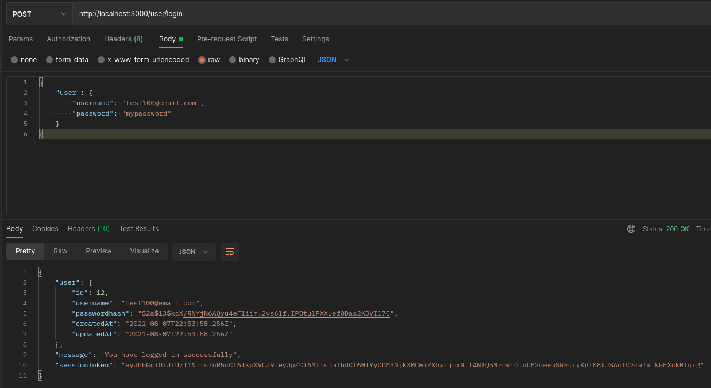

# /log/ -POST- Allows users to create a workout log with descriptions, definitions, & results along with owner properties.

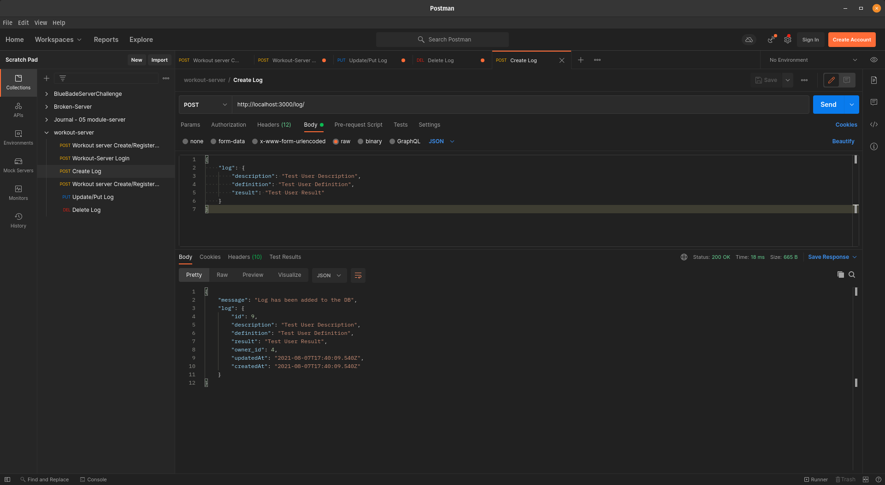

# /log/ -GET- Gets all logs for an individual user.

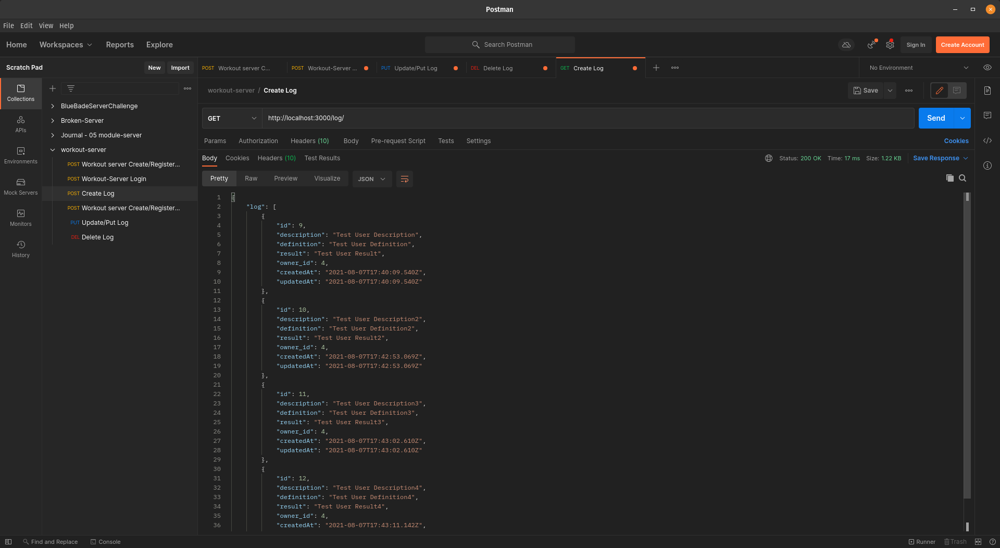

# /log/:id -GET- Gets individual logs by id for individual user.

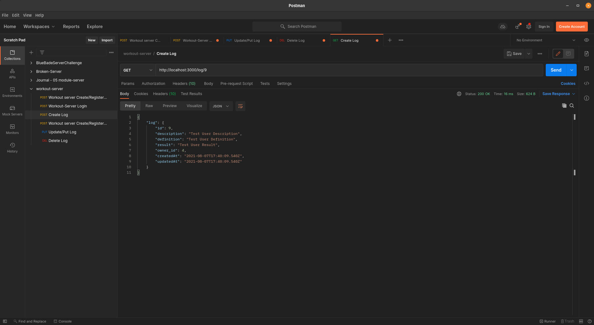

# /log/id -PUT- allows individual logs to be updated by a user

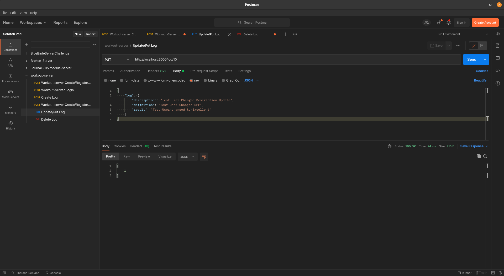

# PGadmin after Update

# /log/id -DELETE- Allows individual logs to be deleted by a user

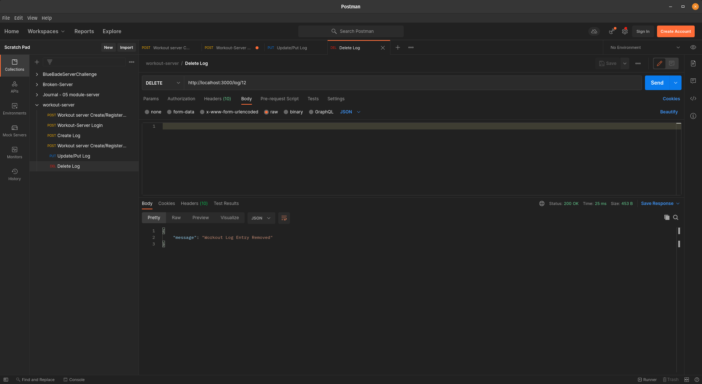

# PGadmin After Delete

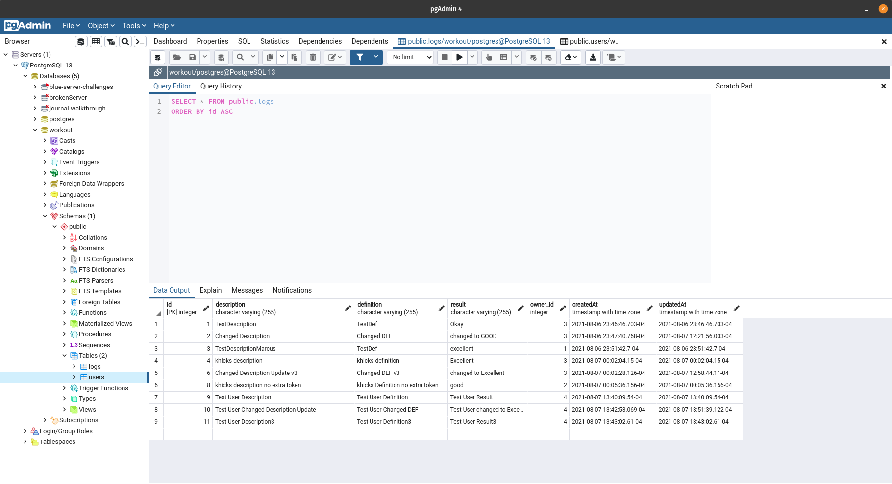

# !!!!Workout Log Server - Client!!!!

# Signup/Register new User (Before)

# Signup/Register new User (After)

# Login (Before)

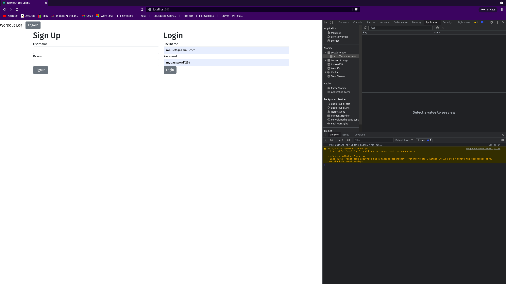

# Login (After)

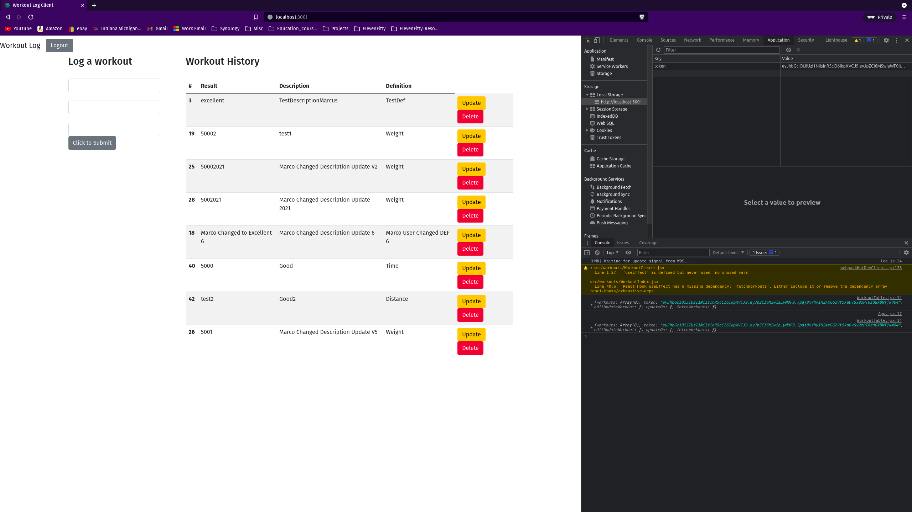

# Create Log

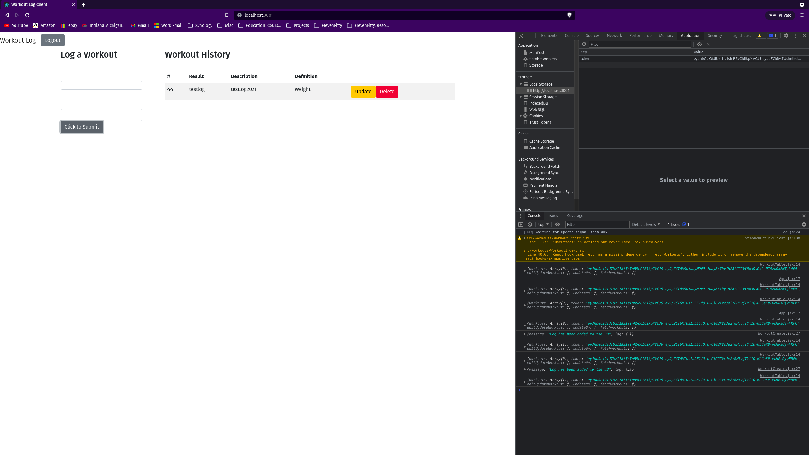

# Delete Log

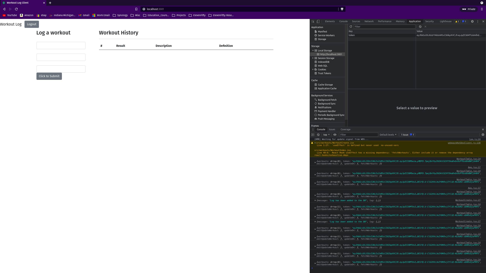

# Update Log (Before)

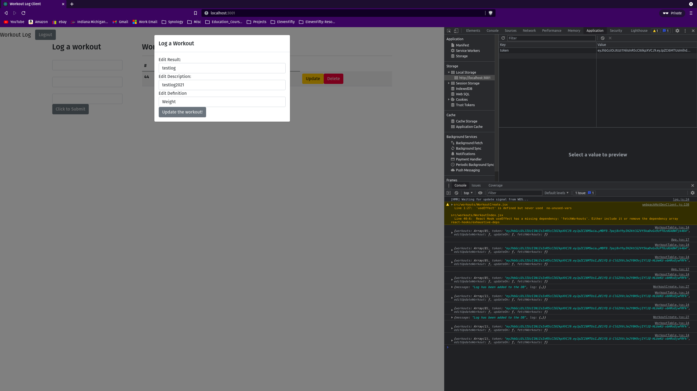

# Update Log (After)

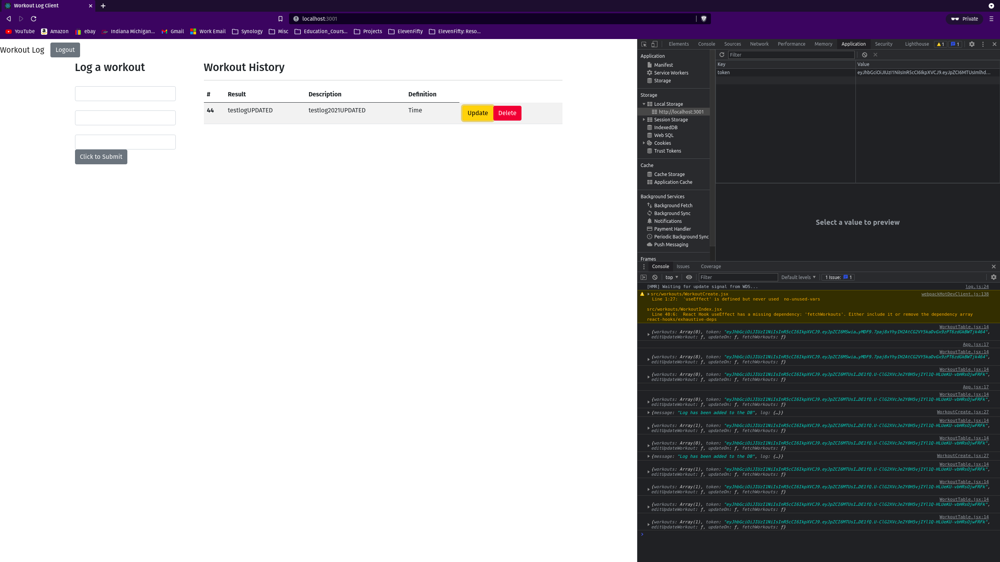
